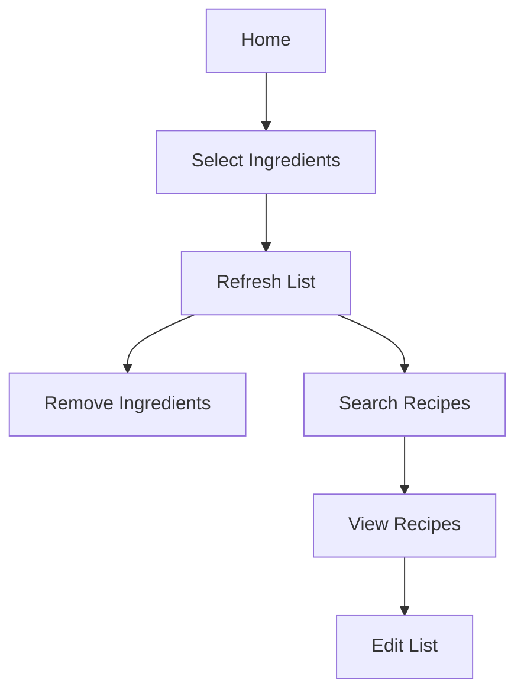

# Cookin'UP

## Project Description

Cookin'UP is a web application developed with Vue.js that helps users find recipes based on the ingredients they have at home. Through an intuitive interface, users can select ingredients from a list, view their choices, and search for recipes that can be prepared with these ingredients.

### Project basic flux

Above is a simple Mermaid diagram representing the app's basic functionality as a flux:


## Features

- Select ingredients from category cards.
- View selected ingredients in a list.
- Remove ingredients from the list.
- Search for recipes based on selected ingredients.
- Edit the list of ingredients for new searches.

## Technologies Used

- Vue.js
- HTML
- CSS
- JavaScript
- TypeScript

## How to Run the Project

1. Clone the repository:
  ```bash
  git clone https://github.com/FernandoAurelius/cookin-up.git
  ```
2. Navigate to the project directory:
  ```bash
  cd cookin-up
  ```
3. Install the dependencies:
  ```bash
  npm install
  ```
4. Run the development server:
  ```bash
  npm run dev
  ```

## Contributions

Contributions are welcome! Feel free to open an issue or submit a pull request

## License

This project is licensed under the Apache-2.0 License - see the LICENSE file for more details.
